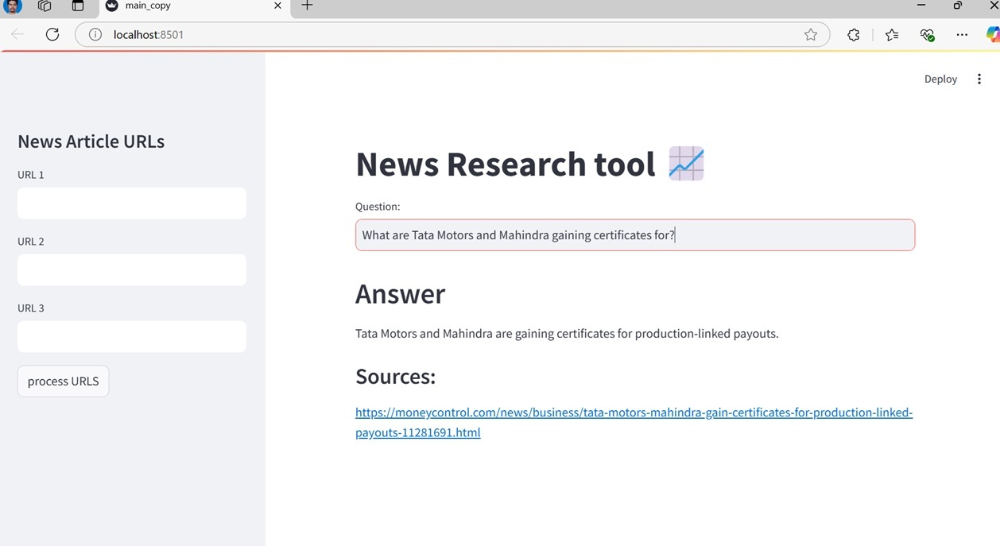

# News Research Tool

News Research Tool is a user-friendly news research tool designed to simplify information retrieval from online articles. It allows users to input news article URLs, process their content, and then ask questions to receive relevant insights, particularly focused on the stock market and financial domain.



## Features

* **URL Loading and Processing:** Load article content by inputting URLs directly or uploading text files containing URLs. The tool uses LangChain's UnstructuredURLLoader to fetch the content.
* **Embedding Vector Generation:** Construct embedding vectors using OpenAI's embeddings. This process converts the text data into a numerical representation that captures its semantic meaning.
* **Efficient Information Retrieval:** Leverage FAISS, a powerful similarity search library, to create and use an index for rapid and effective retrieval of relevant information based on user queries.
* **Interactive Querying:** Interact with the LLM (OpenAI's model) by inputting queries and receiving answers derived from the processed articles, along with the source URLs for verification.
* **Persistent Index:** The FAISS index is saved in a local file (pickle format) for future use, allowing for faster subsequent queries without reprocessing the URLs.


## Usage/Examples

1.  Run the Streamlit app by executing:

    ```bash
    streamlit run main.py
    ```

2.  The web app will open in your browser.

3.  On the sidebar:

    * Input up to three news article URLs in the provided text boxes.

4.  Initiate the data loading and processing by clicking the "Process URLs" button.

5.  Observe the system as it performs the following steps:

    * Loads the data from the provided URLs.
    * Splits the text into manageable chunks.
    * Generates embedding vectors for the text chunks.
    * Builds and indexes the vectors using FAISS for efficient retrieval.
    * Saves the FAISS index to a local file in pickle format (`faiss_store_google_palm.pkl`) for future use.

6.  Once the processing is complete, you can ask questions related to the content of the processed news articles in the main text input area.

7.  The app will provide an answer generated by the LLM, along with a list of source URLs used to derive the answer.

### Example Usage Scenario:

In the provided video tutorial, the following news articles were used:

* [https://www.moneycontrol.com/news/business/tata-motors-mahindra-gain-certificates-for-production-linked-payouts-11281691.html](https://www.moneycontrol.com/news/business/tata-motors-mahindra-gain-certificates-for-production-linked-payouts-11281691.html)
* [https://www.moneycontrol.com/news/business/tata-motors-launches-punch-icng-price-starts-at-rs-7-1-lakh-11098751.html](https://www.moneycontrol.com/news/business/tata-motors-launches-punch-icng-price-starts-at-rs-7-1-lakh-11098751.html)
* [https://www.moneycontrol.com/news/business/stocks/buy-tata-motors-target-of-rs-743-kr-choksey-11080811.html](https://www.moneycontrol.com/news/business/stocks/buy-tata-motors-target-of-rs-743-kr-choksey-11080811.html)

You can use these URLs to test the application and ask questions like:

* "What is the target price for Tata Motors according to the articles?"
* "What new car did Tata Motors launch?"
* "What are Tata Motors and Mahindra gaining certificates for?"

## Acknowledgements

This project was inspired by the work of Dhaval Patel from codebasiscs

* [https://github.com/codebasics/](https://github.com/codebasics/)